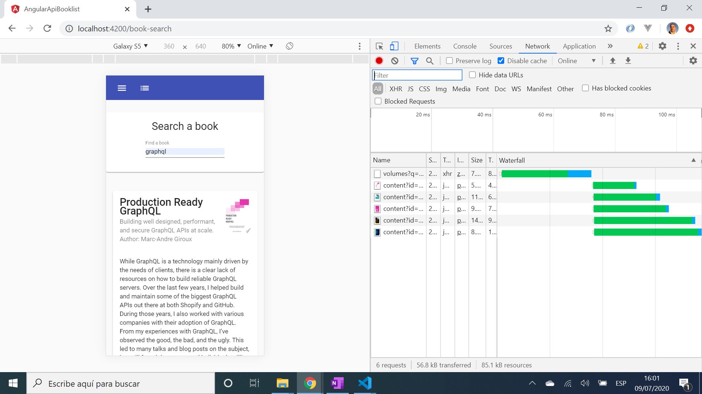

# :zap: Angular API Booklist

* Angular with Angular Material app to search for books from the Google Books API
* Displays initial list of books using predefined list query
* Allows user to search for books using a query string of 4 or more letters
* **Note:** to open web links in a new window use: _ctrl+click on link_


## :page_facing_up: Table of contents

* [:zap: Angular API Booklist](#zap-angular-api-booklist)
  * [:page_facing_up: Table of contents](#page_facing_up-table-of-contents)
  * [:books: General info](#books-general-info)
  * [:camera: Screenshots](#camera-screenshots)
  * [:signal_strength: Technologies](#signal_strength-technologies)
  * [:floppy_disk: Setup](#floppy_disk-setup)
  * [:flashlight: Testing](#flashlight-testing)
  * [:computer: Code Examples](#computer-code-examples)
  * [:cool: Features](#cool-features)
  * [:clipboard: Status & To-Do List](#clipboard-status--to-do-list)
  * [:clap: Inspiration](#clap-inspiration)
  * [:file_folder: License](#file_folder-license)
  * [:envelope: Contact](#envelope-contact)

## :books: General info

* Book search form and search results displayed using mat-cards

## :camera: Screenshots

* 

## :signal_strength: Technologies

* [Angular v13](https://angular.io/) javascript framework
* [Angular Material v13](https://material.angular.io/) component library
* [Angular Material Icons](https://material.io/resources/icons/?style=baseline)
* [@ngrx/store](https://ngrx.io/guide/store) RxJS powered state management

## :floppy_disk: Setup

* Install dependencies using `npm i`
* Run `ng serve` to get a server at `http://localhost:4200/`
* If required, run `ng build` to build the project. The build artifacts will be stored in the `dist/` directory. Use the `--prod` flag for a production build.

## :computer: Code Examples

* extract from google-books.service.ts to retrieve book search items from Google Books API

```typescript
export class GoogleBookService {
  private API_URL = "https://www.googleapis.com/books/v1/volumes";

  constructor(private http: HttpClient) {}

  findBook(title: string): Observable<Book[]> {
    return this.http
      .get<GoogleBooksApiInterface>(`${this.API_URL}?q=${title}`)
      .pipe(map((data: GoogleBooksApiInterface) => data.items));
  }
}
```

## :cool: Features

* Google book search API does not require a key
* Uses [*ngFor](https://blog.angular-university.io/angular-2-ngfor/) first and last of list identifiers to change CSS class colors

## :clipboard: Status & To-Do List

* Status: Working
* To-Do:  Nothing

## :clap: Inspiration

* [Google Books APIs: Performing a Search](https://developers.google.com/books/docs/v1/using)
* [Tutorial Tips: Cannot find name '..'. Do you need to change your target library?](https://tutorial.tips/solved-cannot-find-name-do-you-need-to-change-your-target-library/)

## :file_folder: License

* This project is licensed under the terms of the MIT license.

## :envelope: Contact

* Repo created by [ABateman](https://github.com/AndrewJBateman), email: gomezbateman@yahoo.com
